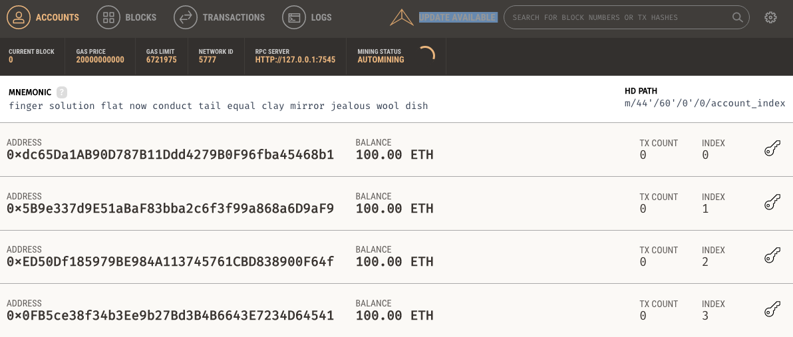

# **인프런 -블록체인 이더리움 부동산 댑(Dapp) 만들기 **

- #### 계기 : 한이음 프로젝트 공모전 준비
-	4차 산업혁명, 블록체인 기술, 스마트 컨트랙트를 통해 중개인의 역할을 디지털 적으로 대체. 
-	이더리움 가상화폐 => 스마트 컨트랙트를 블록체인에서 작동 가능케한 최초의 플랫폼
-	강좌를 통해 Dapp을 제작할 예정
-	부동산 관련 앱. 메타 마스크를 통해 제작할 예정
-	트러플과 가나슈 사용 예정

## 1. 개발환경 셋업(Geth,가나슈,노드.js,트러플)
- #### Geth 설치
- go Ethereum의 약자. go 언어로 만들어짐. 풀 이더리움 노드를 내 로컬 환경에서 커맨드라인 인터페이스를 통해 실행시키는 프로그램. 저수준이라 어렵지만 배울 게 많다.
- ※ Geth는 가장 최신 버전으로 설치함. `1.8.27-stable`

- #### Ganache 설치
- 가나슈 `v1.1.0 - Candy Apple`로 설치함
- 가나슈는 스마트컨트랙트 개발에 있어서 편리한 인터페이스 제공
- UI로 제공하는 이더리움 블록체인 툴
 

- Current Block : 노드에서 채굴한 마지막 블록 넘버
- Gas Price : 노드가 트랜잭션을 채굴하기 위한 최소한의 가스 가격
- Gas Limit: 트랜잭션을 마치기 위해 필요한 최대한의 가스 
- netWork Id : 가나슈 서버의 내부 블록체인 식별 ID가 현재 5777로 초기 설정 되어서 이더리움 노드를 실행함.
- IPC Server : Geth나 메타마스크에서 이 주소로 연결하면 가나슈 환경에서 그대로 쓸 수 있도록 해주는 것
- Mining status: 새로운 블록은 채굴하는 속도를 보여준다.
- MNEMONI : 여러 단어들의 조합. 이 단어 조합을 사용해서, 아래 계정들을 생성하는 비밀 문자들. 이 문장가지고 메타마스크 같은 곳에서 가나슈 계정들을 쉽게 옮길 수 있도록 도와준다. 가나슈 설치시 랜덤으로 생성이 되는데, 원활한 진행을 위해서 모드 같은 MNEMONI으로 바꿀 것.
- key 생성시 고려. (shaft clap gun expire course crouch magnet furnace grant shop used vacant)
- TX count : 이 계정 주소에서 트랜잭션을 몇번 처리했는지 count, index는 이 계정이 생성된 계정들 중에 몇번 쨍 위치해 있는지 보여준다. key모양 버튼을 클릭하면, 이 계정의 개인 비밀키를 볼 수 있다.
- 기본 인터페이스 설명.

- #### npm, Node js 설치

- #### truffle 설치 -> 스마트컨트랙을 컴파일하고 테스트, 배포도 도와주는 프레임워크.
-	`npm uninstall -g truffle npm install -g truffle@4.1.15`

## 2. 개발환경 셋업 2 (비쥬얼 스튜디오 코드, 메타마스크)

-	visual studio code install
-	solidity 확장 어플 다운
-	metamask.io
-	create Account 메타 마스크가 메인 넷이나 다른 테스트 네트워크에 연결한 상태라면, 랜덤으로 새로운 계정을 생성한다.
-	private key도 seed phrase처럼 잃어버리면 안된다.
-	생성된 계정은 메타마스크 안에서 지울 수 없다. 지우고 싶다면 메타마스크를 지우고 새로 설치해야 한다.
- private key 사용해서 계정 불러온 경우, seed phrase써서 계정 복구할 때, import해서 불러온 계정들은 복구가 되지 않는다는 점 기억하자.

## 참조
<https://www.inflearn.com/course/blockchain-%EC%9D%B4%EB%8D%94%EB%A6%AC%EC%9B%80-dapp#>

-	Geth
<https://geth.ethereum.org/install-and-build/Installation-Instructions-for-Mac>

-	ganache
<https://github.com/trufflesuite/ganache/releases/tag/v1.1.0>

- metamask
<metamask.io>
